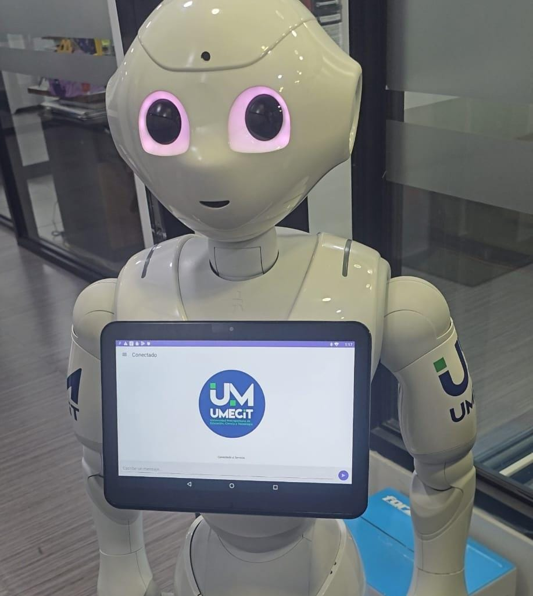
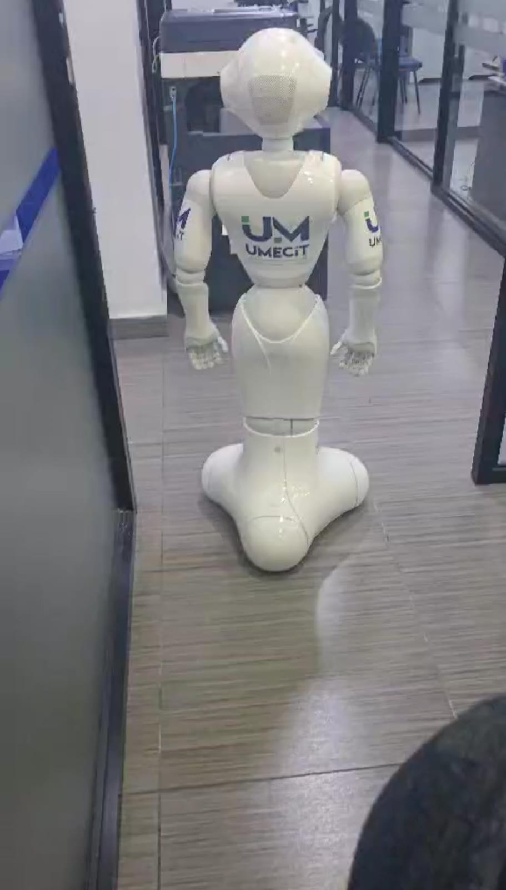
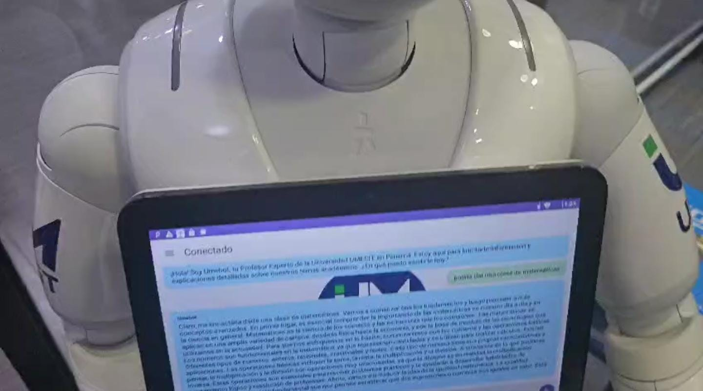
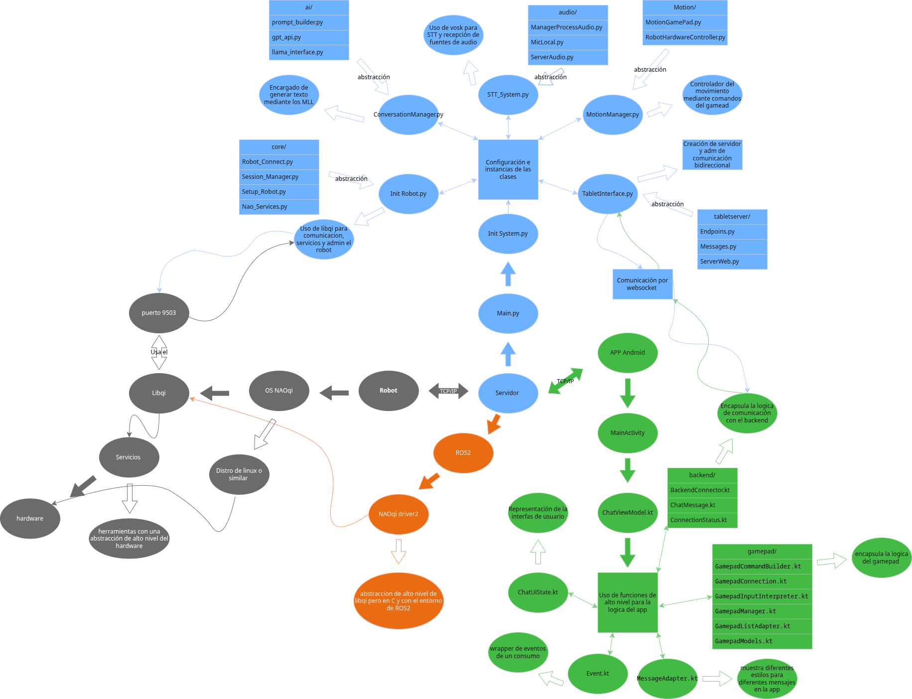

# UMEBOT Robotics Project

[English](README.md) | [Español](README.es.md)

---

## Project Vision

UMEBOT is more than just a robot; it is the technological symbol of UMECIT University and a piece of engineering with enormous potential. It was born with a vision: to transform the university into a pioneer in teaching with autonomous robots, with the ultimate goal that UMEBOT can become a robotic professor.

---
## Purpose of This Repository

This repository serves as the central documentation and visualization of the UMEBOT experimental prototype. Its primary purpose is twofold:

* **Foundation for the Future:** To serve as a solid codebase and architectural foundation upon which future implementations and improvements of the robot can be built.
* **Technical Reference:** To act as a case study and a detailed technical reference for other students, developers, or researchers interested in service robotics, conversational AI, and complex system integration.

For a complete and detailed understanding of the project, it is highly recommended to consult the comprehensive documentation hosted on Google Drive.

---
## Video Demonstration

Click on the images to see the system in action.

| Gamepad Control | Conversation (Mathematics Professor) |
| :---: | :---: |
|  |  |

---

## System Architecture

The project utilizes a Client-Server architecture to maximize performance and flexibility.

---

## Technologies Used

* **Backend:** Python, FastAPI, libqi, WebSockets
* **Frontend:** Kotlin, Android SDK, MVVM, OkHttp
* **Artificial Intelligence:** GPT-4, Phi-3, Vosk (STT)
* **Robotics:** ROS2 (conceptual), Naoqi OS

---

## Getting Started

For detailed installation and execution instructions, please refer to the guides in their respective directories:

* **[Backend Guide (Server)](backend-python/README.md)**
* **[Frontend Guide (Android App)](frontend_kotlin/README.md)**

---

## Full Documentation

For an in-depth dive into the history, challenges, and analysis of each module, you can consult the complete project documentation.

**[Read the Full Documentation on Google Docs](https://docs.google.com/document/d/1S1QWxnhAV4Ik9rURn3ecavuSRjm7s95CjpAvrnoCoAQ/edit?usp=sharing)**

---

## About the Author

It has been an incredible honor and pleasure to complete this project at 18 years old. Thank you for taking the time to explore my work. If you have any questions or would like to connect, feel free to reach out.

**Carlos Duarte**
* **LinkedIn:** [https://www.linkedin.com/in/carlos-duarte-6b8464346/](https://www.linkedin.com/in/carlos-duarte-6b8464346/)

---

## Acknowledgments and References

This project was developed under the supervision and with the support of UMECIT University.

* **Institution:** [UMECIT University](https://umecit.edu.pa/)
* **Department:** [Technology Department](https://respaldo.umecit.edu.pa/direccion-de-tecnologia/)
